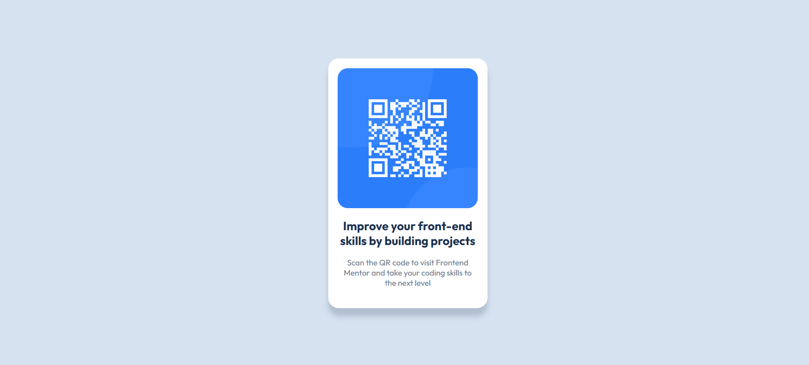

# Frontend Mentor - QR code component solution

This is a solution to the [QR code component challenge on Frontend Mentor](https://www.frontendmentor.io/challenges/qr-code-component-iux_sIO_H). Frontend Mentor challenges help you improve your coding skills by building realistic projects. 

## Table of contents

- [Overview](#overview)
  - [Screenshot](#screenshot)
  - [Links](#links)
- [My process](#my-process)
  - [Built with](#built-with)
  - [What I learned](#what-i-learned)
  - [Continued development](#continued-development)
  - [Useful resources](#useful-resources)
- [Author](#author)
- [Acknowledgments](#acknowledgments)


## Overview

### Screenshot



### Links

- Solution Github: [Repository](https://github.com/Jascran23/Front-Mentor-Initial)
- Live Site: [Solution Page](https://jascran23.github.io/Front-Mentor-Initial/)

## My process

### Built with

- Semantic HTML5 markup
- CSS custom properties
- Flexbox
- CSS Grid
- Mobile-first workflow
- Google Fonts


### What I learned

During this project I reinforced and learned some important concepts.
- such as importing Google Fonts.

```html
<link rel="preconnect" href="https://fonts.googleapis.com">
<link rel="preconnect" href="https://fonts.gstatic.com" crossorigin>
<link href="https://fonts.googleapis.com/css2?family=Outfit:wght@100..900&display=swap" rel="stylesheet">
```
- Use of flex display.
```css
.proud-of-this-css {
  color: papayawhip;
}
```

### Continued development

I want to continue developing and achieve bigger projects with more clarity.


### Useful resources

- [W3 Schools](https://www.w3schools.com/) - For a better understanding of the flex display
- [Google Fonts](https://fonts.google.com/) -  A great resource for finding and implementing web fonts.

## Author

- Frontend Mentor - [Jascran23](https://www.frontendmentor.io/profile/Jascran23)